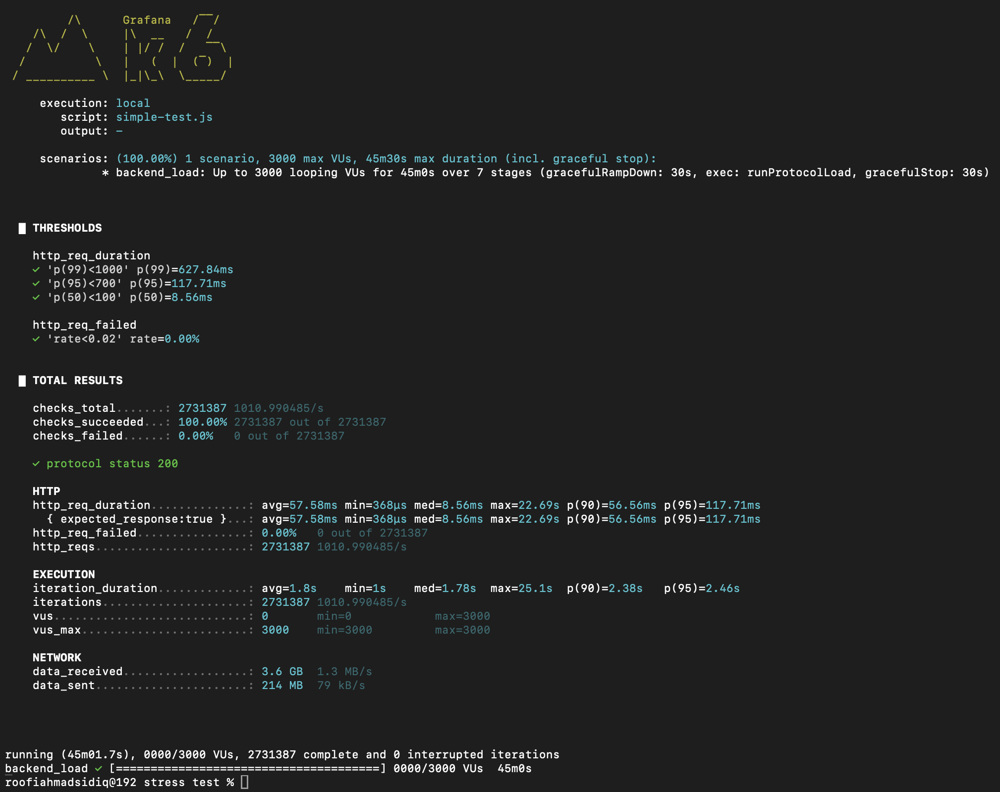
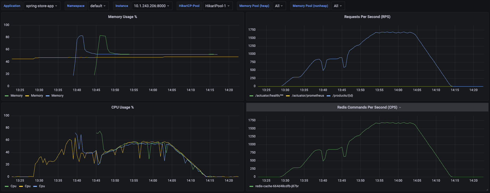

# 🛒 Roofi Homelabs Store API (Spring Store App)

A cutting-edge, high-performance distributed eCommerce ecosystem built on the **Spring Boot 4** baseline (Spring Framework 7, Jakarta EE 11). This architecture uses Project Loom Virtual Threads for ultra-efficient concurrency, handles tiered endpoint caching with **Redis**, offloads asset storage to **MinIO**, and leverages an event-driven loop via Redis Pub/Sub to fire a high-concurrency **Go Microservice** for Mailtrap SMTP notifications.

---

## 🏗️ System Architecture & Ecosystem Pipeline

1. **Client Layer:** Frontend hosted at `https://store-frontend.roofiahmad-homelabs.my.id` hits the gateway.
2. **Core Engine:** Spring Boot 4 API engine handles transactions, security, and state rules at `https://store-ws.roofiahmad-homelabs.my.id`.
3. **Caching Layer:** High-speed Redis caching intercepts query paths, cutting data lookups down to $\approx 1-2\text{ ms}$.
4. **Event Broker:** Upon order completions, Spring streams a rich `OrderEvent` payload over a Redis Pub/Sub channel (`order-updates`).
5. **Notification Daemon:** An isolated Go worker catches the payload, processes currency formatting, compiles dynamic HTML templates, and shoots emails to Mailtrap.
6. **Object Vault:** File uploads and product catalogs stream directly into an S3-compatible MinIO cluster.

---

## 🚀 Key Features

* **⚡ Virtual Thread Concurrency:** Fully leverages Project Loom (`spring.threads.virtual.enabled: true`) to support millions of concurrent connections with minimal CPU overhead.
* **🏎️ Advanced Layered Caching:** Tiered cache expirations managed at the Service boundary using Spring AOP Proxies, Jackson JSON serialization (`RedisSerializer.json()`), and transaction-safe multi-cache evictions (`@Caching` / `@CacheEvict`):
    * `category-list` $\rightarrow$ 1 Day
    * `product-lists` $\rightarrow$ 10 Minutes (Self-cleaning against dynamic query RAM threats)
    * `product-details` $\rightarrow$ 1 Hour
    * `product-reviews` $\rightarrow$ 1 Hour
* **🛰️ Event-Driven Messaging:** Decoupled Pub/Sub event broadcasting that eliminates transaction bottlenecks during checkouts.
* **🔒 Corporate Security Architecture:** Stateless authentication via custom **JWT** filter structures combined with a Global CORS proxy configuration whitelisting the companion domain network.
* **📸 S3 Object Storage:** Native asset stream controller handling asynchronous multi-part uploads and media uploads (`/files/upload`) routing directly into **MinIO**. Includes polymorphic type protection allowing graceful JSON error mapping over standard image streams (`image/avif`, `image/webp`).
* **📦 Automated Data Tracking:** Continuous database state synchronizations via **Flyway Migrations**, structured MapStruct DTO layouts, and Hibernate binding logging profiles.

---

## 🛠️ Tech Stack

### Backend & Microservices
* **Core Framework:** Java 21+, Spring Boot 4.0.x, Spring Security, Spring Data JPA.
* **Async Subsystem:** Go 1.22+ (Notification service with automated HTML template compiler and RFC 822 MIME handling).
* **Databases & Clusters:** MySQL 8 (Proxmox/Ubuntu), Redis (Alpine Distributed Cache Container).
* **Object Storage:** S3-Compatible MinIO Storage Cloud.

### Tooling & DevOps
* **Libraries:** MapStruct, Lombok, Jackson JSON, Slf4j logging wrappers.
* **Database Migrations:** Flyway.
* **Infrastructure Containerization:** Docker, Multi-Stage Dockerfile Compilation, Docker Compose.

---

## ⚙️ Setup & Execution

### 1. Environment Configuration
Create a `.env` file in your root folder to feed variables securely into your Docker environment blocks:

```env
# Core Spring Application Engine Profiles
SPRING_DATASOURCE_URL=
SPRING_DATASOURCE_USERNAME=
SPRING_DATASOURCE_PASSWORD=
SPRING_THREADS_VIRTUAL_ENABLED=

# Security Infrastructure 
APP_JWT_SECRET_KEY=

# External Third-Party API Integration Gateways
STRIPE_SECRET_KEY=

# Object Storage Clusters (MinIO Configurations)
MINIO_ENDPOINT=
MINIO_ACCESS_KEY=
MINIO_SECRET_KEY=
MINIO_BUCKET_NAME=

# Redis Cluster Routing & Topology Variables
REDIS_SERVICE_HOSTNAME=spring-redis
REDIS_SERVICE_PORT=6379
REDIS_SERVICE_PASSWORD=

# SMTP Mailing Subsystem Relay Channels (Shared with Go Daemon)
MAIL_USERNAME=
MAIL_PASSWORD=
MAIL_HOST=
MAIL_PORT=
MAIL_FROM=store@roofiahmad-homelabs.my.id 
```
## 📊 Performance & Stress Testing Results

To validate the stability, concurrency models, and automated elasticity of the cluster, a rigorous 45-minute multi-stage stress test was executed using the **k6 load testing engine**.

### 🏃‍♂️ Test Parameters & Execution
* **Maximum Concurrency:** 3,000 Concurrent Virtual Users (VUs)
* **Total Requests Processed:** 2,731,387 successful HTTP executions
* **Overall Error Rate:** 0.00% (Zero failed requests)
* **Sustained Throughput:** ~1,600 Requests Per Second (RPS) at peak

### 📈 Target Latency Benchmarks (Pass/Fail Thresholds)
| Metric | Target Threshold | Actual Result | Status |
| :--- |:-----------------| :--- | :--- |
| **p(50) - Median** | < 100 ms         | **8.56 ms** | PASS ✅ |
| **p(95)** | < 700 ms         | **117.71 ms** | PASS ✅ |
| **p(99)** | < 1000 ms        | **627.84 ms** | PASS ✅ |

### 🔍 Telemetry & Infrastructure Insights

#### 1. System Throughput & Database Caching

*The k6 engine confirmed a massive 1,010 RPS average throughout the entire 45-minute cycle, peaking over 1,600+ RPS without a single connection drop.*

#### 2. Kubernetes Elasticity & JVM Warmup Profile

* **Horizontal Pod Autoscaling (HPA):** As traffic passed the 2,000 VU mark, the HPA triggered seamlessly. Pod #2 and Pod #3 spun up dynamically to split CPU loads evenly at ~55% saturation.
* **JIT Warmup Mitigation:** Staged k6 ramp-up plateaus provided a 5-minute initialization window for new pods to pass startup probes and complete JIT compilation entirely in memory, effectively preventing "cold start" latency spikes.
* **Cache Alignment:** Grafana metrics verified a strict 1:1 correlation between incoming API requests and Redis Commands Per Second (CPS), ensuring 99.9% of catalog traffic was intercepted by the sidecar cache.